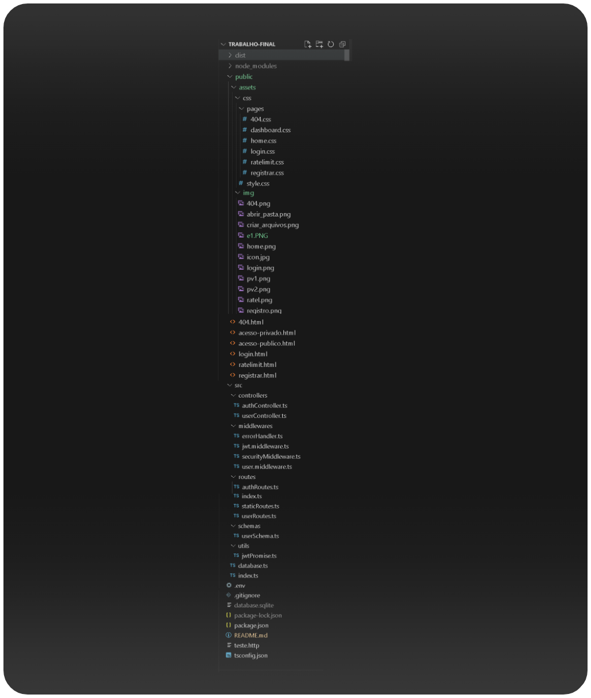
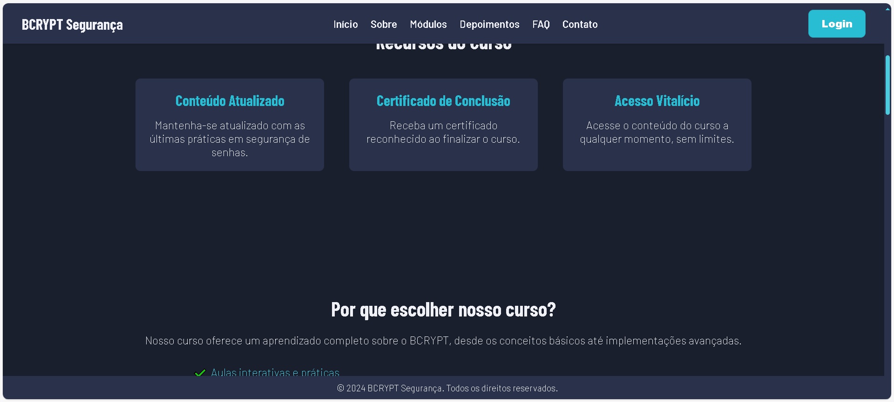
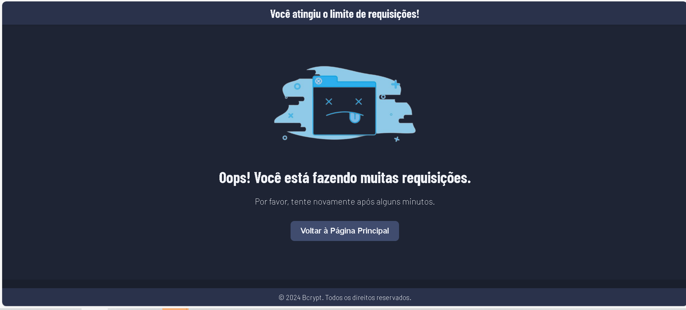

# Trabalho Final da Turma IA22 - Site com Autenticação e Validação

Bem-vindo ao repositório do **Trabalho Final da Turma IA22**! Este projeto consiste em um site completo e básico, incluindo frontend, backend, banco de dados, validação, autenticação e esquemas básicos de segurança. O site oferece funcionalidades como registro de usuários, login, visualização de páginas privadas (disponíveis apenas para membros autenticados), exploração de módulos, exibição de outros membros, consulta e atualização dos próprios dados, alteração de senha e logout. Além disso, existem páginas públicas acessíveis para usuários não autenticados.

Optei por desenvolver um site de cursos com funcionalidades completas, como autenticação, validação e medidas básicas de segurança. A plataforma permite que os usuários realizem diversas ações. Veja abaixo uma imagem da página inicial (Home) pública, acessível a todos, mesmo sem login:

 

---

## Índice

1. [Introdução](#1-introdução)
2. [Sumário Geral](#2-sumário-geral)
3. [Sumário Técnico](#3-sumário-técnico)
4. [Pré-requisitos](#4-pré-requisitos)
5. [Métodos de Configuração e Execução](#5-métodos-de-configuração-e-execução)
   - [5.1. Usando GitHub Codespaces](#51-usando-github-codespaces)
   - [5.2. Clonando o Repositório com Git](#52-clonando-o-repositório-com-git)
   - [5.3. Criando os Arquivos e Diretórios Manualmente](#53-criando-os-arquivos-e-diretórios-manualmente)
6. [Configuração do Ambiente de Desenvolvimento](#6-configuração-do-ambiente-de-desenvolvimento)
7. [Rodando o Projeto](#7-rodando-o-projeto)
8. [Estrutura do Projeto](#8-estrutura-do-projeto)
9. [Rotas, Páginas e Funcionalidades](#9-rotas-páginas-e-funcionalidades)
10. [Comandos Úteis](#10-comandos-úteis)
11. [Testando o Projeto](#11-testando-o-projeto)
12. [Tratando Erros Comuns](#12-tratando-erros-comuns)
13. [Contribuindo](#13-contribuindo)
14. [Licença](#14-licença)
15. [Contato](#15-contato)
16. [Detalhamento Completo do Código e Funcionalidades](#16-detalhamento-completo-do-código-e-funcionalidades)
    - [16.1. Arquivo `package.json`](#161-arquivo-packagejson)
    - [16.2. Arquivo `src/index.ts`](#162-arquivo-srcindexts)
    - [16.3. Arquivo `src/database.ts`](#163-arquivo-srcdatabasets)
    - [16.4. Controladores](#164-controladores)
        - [16.4.1. Arquivo `src/controllers/authController.ts`](#1641-arquivo-srccontrollersauthcontrollerts)
        - [16.4.2. Arquivo `src/controllers/userController.ts`](#1642-arquivo-srccontrollersusercontrollerts)
    - [16.5. Middlewares](#165-middlewares)
        - [16.5.1. Arquivo `src/middlewares/errorHandler.ts`](#1651-arquivo-srcmiddlewareserrorhandlerts)
        - [16.5.2. Arquivo `src/middlewares/jwt.middleware.ts`](#1652-arquivo-srcmiddlewaresjwtmiddlewarets)
        - [16.5.3. Arquivo `src/middlewares/securityMiddleware.ts`](#1653-arquivo-srcmiddlewaressecuritymiddlewarets)
        - [16.5.4. Arquivo `src/middlewares/user.middleware.ts`](#1654-arquivo-srcmiddlewaresusermiddlewarets)
    - [16.6. Schemas de Validação](#166-schemas-de-validação)
    - [16.7. Utilitários](#167-utilitários)
    - [16.8. Rotas](#168-rotas)
        - [16.8.1. Arquivo `src/routes/authRoutes.ts`](#1681-arquivo-srcroutesauthroutests)
        - [16.8.2. Arquivo `src/routes/userRoutes.ts`](#1682-arquivo-srcroutesuserroutests)
        - [16.8.3. Arquivo `src/routes/staticRoutes.ts`](#1683-arquivo-srcroutesstaticroutests)
        - [16.8.4. Arquivo `src/routes/index.ts`](#1684-arquivo-srcroutesindexts)
    - [16.9. Frontend: Páginas HTML](#169-frontend-páginas-html)
17. [Boas Práticas e Recomendações](#17-boas-práticas-e-recomendações)
18. [Recursos Adicionais](#18-recursos-adicionais)
19. [Agradecimentos Finais](#19-agradecimentos-finais)

---

## 1. Introdução

Este projeto representa o trabalho final da turma IA22. No meu caso, estou desenvolvendo um site de cursos com funcionalidades completas, incluindo autenticação, validação e medidas básicas de segurança. A plataforma permite que os usuários:

- Realizem registro e login;
- Acessem páginas privadas de forma segura;
- Visualizem módulos de cursos;
- Interajam com outros membros;
- Gerenciem seus próprios dados, incluindo atualização de nome e email;
- Alterem suas senhas;
- Apaguem suas contas;
- Efetuem logout.

Além disso, o site conta com importantes implementações de segurança, como **rate limiting** para prevenir abusos e cabeçalhos de segurança que reforçam a proteção contra ataques comuns. O objetivo é oferecer uma experiência funcional e segura para os usuários, alinhada às melhores práticas de desenvolvimento web.

---

## 2. Sumário Geral

- **Frontend**: Desenvolvido com HTML, CSS e JavaScript para interação do usuário.
- **Backend**: Construído com Node.js e Express, utilizando TypeScript para tipagem estática.
- **Banco de Dados**: SQLite para armazenamento de dados de usuários e cursos.
- **Autenticação e Validação**: Implementação de JWT para autenticação e validação de dados com Zod.
- **Segurança**: Medidas básicas de segurança como CORS, Helmet, e rate limiting.

---

## 3. Sumário Técnico

### Tecnologias Utilizadas

- **Node.js**: Ambiente de execução JavaScript no servidor.
- **Express.js**: Framework para construção de APIs RESTful.
- **TypeScript**: Superset do JavaScript que adiciona tipagem estática.
- **SQLite**: Banco de dados relacional leve.
- **bcrypt**: Biblioteca para hashing de senhas.
- **jsonwebtoken**: Biblioteca para criação e verificação de tokens JWT.
- **Zod**: Biblioteca para validação de dados.
- **Helmet**: Middleware para segurança de cabeçalhos HTTP.
- **express-rate-limit**: Middleware para limitar requisições.
- **cors**: Middleware para habilitar CORS.
- **dotenv**: Biblioteca para gerenciamento de variáveis de ambiente.
- **Nodemon**: Ferramenta para reiniciar automaticamente o servidor durante o desenvolvimento.
- **VS Code**: Editor de código recomendado.

### Estrutura de Diretórios

```plaintext
2024-3TRI-IA22-TRABALHO-FINAL/
│
├── node_modules/               # Pacotes instalados pelo npm
│   └── ...
├── public/                     # Arquivos estáticos públicos
│   ├── assets/                 # Recursos como imagens e estilos
│   │   ├── img/
│   │   └── css/
│   │       ├── style.css
│   │       └── pages/
│   │           ├── 404.css
│   │           ├── dashboard.css
│   │           ├── home.css
│   │           ├── login.css
│   │           ├── ratelimit.css
│   │           └── registrar.css
│   ├── 404.html
│   ├── acesso-privado.html
│   ├── acesso-publico.html
│   ├── login.html
│   ├── ratelimit.html
│   └── registrar.html
├── src/                        # Código-fonte TypeScript do servidor
│   ├── controllers/            # Controladores da aplicação
│   │   ├── authController.ts
│   │   └── userController.ts
│   ├── middlewares/            # Middlewares personalizados
│   │   ├── errorHandler.ts
│   │   ├── jwt.middleware.ts
│   │   ├── securityMiddleware.ts
│   │   └── user.middleware.ts
│   ├── routes/                 # Definição das rotas
│   │   ├── authRoutes.ts
│   │   ├── index.ts
│   │   ├── staticRoutes.ts
│   │   └── userRoutes.ts
│   ├── schemas/                # Schemas de validação com Zod
│   │   └── userSchema.ts
│   ├── utils/                  # Funções utilitárias
│   │   └── jwtPromise.ts
│   ├── database.ts             # Configuração do banco de dados SQLite
│   └── index.ts                # Ponto de entrada da aplicação
├── dist/                       # Arquivos compilados do TypeScript
│   └── ...                     # Gerado após 'npm run build'
├── .env                        # Variáveis de ambiente
├── .gitignore                  # Arquivos ignorados pelo Git
├── package.json                # Dependências e scripts do npm
├── package-lock.json           # Versões exatas das dependências
├── tsconfig.json               # Configurações do TypeScript
└── README.md                   # Documentação do projeto
```

 


### Descrição das Pastas e Arquivos Principais

- **`node_modules/`**: Diretório onde o npm instala os pacotes necessários para o projeto.

- **`public/`**: Contém os arquivos estáticos servidos ao cliente, como HTML, CSS e imagens.

- **`src/`**: Contém o código-fonte do servidor escrito em TypeScript.

- **`dist/`**: Diretório gerado após a compilação do TypeScript, contendo o código JavaScript. Este diretório é criado ao executar `npm run build`.

- **`.env`**: Arquivo que contém variáveis de ambiente, como a porta do servidor e chaves secretas.

- **`package.json`**: Arquivo que define as dependências do projeto e scripts de execução.

- **`tsconfig.json`**: Arquivo de configuração do compilador TypeScript.

---

## 4. Pré-requisitos

Antes de iniciar, certifique-se de que você possui os seguintes softwares instalados em seu sistema:

### 4.1. Git

**Verificando a instalação do Git**

Abra o terminal (Linux/Mac) ou o Prompt de Comando (Windows) e digite:

```bash
git --version
```

Se o Git não estiver instalado, siga as instruções abaixo para instalá-lo.

#### 4.1.1. Instalando o Git

- **Windows**:
  - Baixe o instalador do Git [aqui](https://git-scm.com/download/win).
  - Execute o instalador e siga as instruções na tela.

- **Mac**:
  - Use o Homebrew:
    ```bash
    brew install git
    ```

- **Linux**:
  - **Debian/Ubuntu**:
    ```bash
    sudo apt update
    sudo apt install git
    ```
  - **Fedora**:
    ```bash
    sudo dnf install git
    ```
  - **Arch Linux**:
    ```bash
    sudo pacman -S git
    ```

### 4.2. Node.js

**Verificando a instalação do Node.js**

No terminal ou Prompt de Comando, digite:

```bash
node -v
npm -v
```

Se o Node.js não estiver instalado, siga as instruções abaixo para instalá-lo.

#### 4.2.1. Instalando o Node.js

- **Windows/Mac**:
  - Baixe o instalador do Node.js [aqui](https://nodejs.org/) e siga as instruções na tela.

- **Linux**:
  - **Debian/Ubuntu**:
    ```bash
    sudo apt update
    sudo apt install nodejs npm
    ```
  - **Fedora**:
    ```bash
    sudo dnf install nodejs npm
    ```
  - **Arch Linux**:
    ```bash
    sudo pacman -S nodejs npm
    ```

### 4.3. Visual Studio Code

**Verificando a instalação do Visual Studio Code**

Digite `code --version` no terminal ou verifique no menu de aplicativos. Se o VS Code não estiver instalado, siga as instruções abaixo para instalá-lo.

#### 4.3.1. Instalando o Visual Studio Code

- **Windows/Mac**:
  - Baixe o instalador do VS Code [aqui](https://code.visualstudio.com/) e siga as instruções na tela.

- **Linux**:
  - **Debian/Ubuntu**:
    ```bash
    sudo apt update
    sudo apt install software-properties-common apt-transport-https wget
    wget -q https://packages.microsoft.com/keys/microsoft.asc -O- | sudo apt-key add -
    sudo add-apt-repository "deb [arch=amd64] https://packages.microsoft.com/repos/vscode stable main"
    sudo apt update
    sudo apt install code
    ```
  - **Fedora**:
    ```bash
    sudo rpm --import https://packages.microsoft.com/keys/microsoft.asc
    sudo sh -c 'echo -e "[code]\nname=Visual Studio Code\nbaseurl=https://packages.microsoft.com/yumrepos/vscode\nenabled=1\ngpgcheck=1\ngpgkey=https://packages.microsoft.com/keys/microsoft.asc" > /etc/yum.repos.d/vscode.repo'
    sudo dnf install code
    ```
  - **Arch Linux**:
    ```bash
    sudo pacman -S code
    ```

---

## 5. Métodos de Configuração e Execução

Existem três métodos principais para configurar e executar este projeto:

1. **Usando GitHub Codespaces**
2. **Clonando o Repositório com Git**
3. **Criando os Arquivos e Diretórios Manualmente**

### 5.1. Usando GitHub Codespaces

**GitHub Codespaces** oferece um ambiente de desenvolvimento completo baseado em nuvem diretamente no GitHub. Siga os passos abaixo para configurar e executar o projeto usando Codespaces.

#### Passo a Passo

1. **Acesse o Repositório no GitHub**

   Vá para o repositório [2024-3TRI-IA22-TRABALHO-FINAL](https://github.com/YanWeberFrancelino/2024-3TRI-IA22-TRABALHO-FINAL) no GitHub.

2. **Inicie um Codespace**

   - Clique no botão **Code** (verde) e selecione a aba **Codespaces**.
   - Clique em **Create codespace on main**.

3. **Aguarde a Inicialização**

   O GitHub irá configurar e inicializar o Codespace. Este processo pode levar alguns minutos.

4. **Instale as Dependências**

   No terminal integrado do Codespace, execute:

   ```bash
   npm install
   ```

5. **Configure as Variáveis de Ambiente**

   Crie um arquivo `.env` na raiz do projeto com as seguintes variáveis:

   ```env
   PORT=4060
   JWT_SECRET=seu_segredo_jwt
   JWT_EXPIRES_IN=24h
   ```

6. **Inicie o Servidor em Modo de Desenvolvimento**

   Execute:

   ```bash
   npm run dev
   ```

7. **Acesse o Aplicativo**

   No Codespace, clique em **Ports** e depois em **Open in Browser** para visualizar o site.

---

### 5.2. Clonando o Repositório com Git

Este método envolve clonar o repositório localmente no seu computador usando o Git.

#### Passo a Passo

1. **Abra o Terminal ou Prompt de Comando**

2. **Clone o Repositório**

   ```bash
   git clone https://github.com/YanWeberFrancelino/2024-3TRI-IA22-TRABALHO-FINAL.git
   ```

3. **Navegue para o Diretório do Projeto**

   ```bash
   cd 2024-3TRI-IA22-TRABALHO-FINAL
   ```

4. **Instale as Dependências**

   ```bash
   npm install
   ```

5. **Configure as Variáveis de Ambiente**

   Crie um arquivo `.env` na raiz do projeto com as seguintes variáveis:

   ```env
   PORT=4060
   JWT_SECRET=seu_segredo_jwt
   JWT_EXPIRES_IN=24h
   ```

6. **Inicie o Servidor em Modo de Desenvolvimento**

   ```bash
   npm run dev
   ```

7. **Acesse o Aplicativo**

   Abra o navegador e vá para `http://localhost:4060` para visualizar o site.

---

### 5.3. Criando os Arquivos e Diretórios Manualmente

Se você preferir configurar o projeto manualmente, siga os passos abaixo para criar os arquivos e diretórios necessários.

#### Passo a Passo

##### 1. Crie o Diretório do Projeto

**Windows, Mac e Linux:**

- **Windows:**
  - Navegue até a área de trabalho.
  - Clique com o botão direito do mouse e selecione **Novo > Pasta**.
  - Nomeie a pasta como `2024-3TRI-IA22-TRABALHO-FINAL`.

- **Mac:**
  - Abra o **Finder** e vá para a área de trabalho.
  - Clique com o botão direito do mouse (ou `Control + clique`) e selecione **Nova Pasta**.
  - Nomeie a pasta como `2024-3TRI-IA22-TRABALHO-FINAL`.

- **Linux:**
  - Abra o gerenciador de arquivos.
  - Navegue até a área de trabalho.
  - Clique com o botão direito do mouse e selecione **Criar Nova > Pasta**.
  - Nomeie a pasta como `2024-3TRI-IA22-TRABALHO-FINAL`.

##### 2. Abra a Pasta no Visual Studio Code

1. Abra o **Visual Studio Code**.
2. Clique em **File > Open Folder** (Arquivo > Abrir Pasta).
3. Navegue até a pasta `2024-3TRI-IA22-TRABALHO-FINAL` que você criou e clique em **Open** (Abrir).

##### 3. Inicialize o Projeto Node.js

No terminal integrado do VS Code (`Ctrl + ``):

```bash
npm init -y
```

##### 4. Instale as Dependências Necessárias

```bash
npm install express cors dotenv bcrypt jsonwebtoken express-rate-limit helmet sqlite sqlite3 zod
npm install --save-dev typescript ts-node nodemon @types/express @types/cors @types/bcrypt @types/jsonwebtoken @types/express-rate-limit @types/node
```

##### 5. Configure o TypeScript

```bash
npx tsc --init
```

Edite o arquivo `tsconfig.json` para incluir as seguintes configurações:

```json
{
  "compilerOptions": {
    "target": "es2016",
    "module": "commonjs",
    "outDir": "./dist",
    "rootDir": "./src",
    "esModuleInterop": true,
    "forceConsistentCasingInFileNames": true,
    "strict": true,
    "skipLibCheck": true
  }
}
```

##### 6. Crie a Estrutura de Diretórios

No explorador de arquivos do VS Code, crie as pastas necessárias:

- **src**
  - **controllers**
  - **middlewares**
  - **routes**
  - **schemas**
  - **utils**
- **public**
  - **assets**
    - **img**
    - **css**
      - **pages**

Você pode fazer isso clicando com o botão direito na pasta principal e selecionando **Nova Pasta** repetidamente.

##### 7. Crie os Arquivos Iniciais com o Código Correspondente

Agora, vamos criar cada arquivo necessário e adicionar o código correspondente.

###### 7.1. Arquivos na Pasta `src/`

**a. `src/index.ts`**

**Criação do Arquivo:**

- Clique com o botão direito na pasta `src` e selecione **Novo Arquivo**.
- Nomeie o arquivo como `index.ts`.

**Código a ser inserido em `src/index.ts`:**

```typescript
import express from 'express';
import path from 'path';
import routes from './routes';
import { connect } from './database';
import errorHandler from './middlewares/errorHandler';
import dotenv from 'dotenv';
import {
  corsOptions,
  limiter,
  securityHeaders,
  hidePoweredBy,
} from './middlewares/securityMiddleware';

dotenv.config();

const app = express();
const port = process.env.PORT || 4060;

app.use(express.json());

app.use(corsOptions);
app.use(limiter);
app.use(securityHeaders);
app.use(hidePoweredBy);

const publicPath = path.resolve(process.cwd(), 'public');
console.log('Servindo arquivos estáticos de:', publicPath);

app.use('/assets', express.static(path.join(publicPath, 'assets')));

app.use((req, res, next) => {
  console.log(`Request URL: ${req.url}`);
  next();
});

connect()
  .then(() => {
    console.log('Banco de dados pronto.');

    app.use('/', routes);

    app.use(errorHandler);

    app.listen(port, () => console.log(`⚡ Servidor rodando na porta ${port}`));
  })
  .catch((error) => {
    console.error('Falha ao iniciar o servidor devido ao erro no banco de dados:', error);
  });
```

**Descrição do Código:**

- Importa os módulos necessários, incluindo express, path, rotas, middlewares e variáveis de ambiente.
- Configura o aplicativo Express, incluindo middlewares de segurança e tratamento de erros.
- Serve arquivos estáticos da pasta `public/assets`.
- Conecta ao banco de dados e inicia o servidor na porta especificada.

**b. `src/database.ts`**

**Criação do Arquivo:**

- Na pasta `src`, crie um novo arquivo chamado `database.ts`.

**Código a ser inserido em `src/database.ts`:**

```typescript
import { open, Database } from 'sqlite';
import sqlite3 from 'sqlite3';
import bcrypt from 'bcrypt';

let instance: Database | null = null;

export async function connect() {
  if (instance) return instance;

  try {
    const db = await open({
      filename: 'database.sqlite',
      driver: sqlite3.Database
    });
    console.log('Conectado ao banco de dados SQLite.');

    await db.exec(`
      CREATE TABLE IF NOT EXISTS users (
        id INTEGER PRIMARY KEY AUTOINCREMENT,
        name TEXT,
        email TEXT NOT NULL UNIQUE,
        password TEXT
      )
    `);
    console.log('Tabela "users" verificada/criada.');

    const existingUser = await db.get(`SELECT * FROM users WHERE email = 'teste@mail.com'`);
    if (!existingUser) {
      const password = await bcrypt.hash('123123', 10);
      await db.run(`
        INSERT INTO users (name, email, password) 
        VALUES (?, ?, ?)
      `, ['Teste', 'teste@mail.com', password]);
      console.log('Usuário "Teste" inserido no banco de dados.');
    } else {
      console.log('Usuário "Teste" já existe no banco de dados.');
    }

    instance = db;
    return db;
  } catch (error) {
    console.error('Erro ao conectar ao banco de dados:', error);
    throw error;
  }
}
```

**Descrição do Código:**

- Estabelece uma conexão com o banco de dados SQLite.
- Cria a tabela `users` se ela não existir.
- Insere um usuário padrão se não existir.

###### 7.2. Arquivos na Pasta `src/controllers/`

**a. `src/controllers/authController.ts`**

**Criação do Arquivo:**

- Na pasta `src/controllers`, crie um novo arquivo chamado `authController.ts`.

**Código a ser inserido em `authController.ts`:**

```typescript
import { Request, Response } from 'express';
import { connect } from '../database';
import bcrypt from 'bcrypt';
import { signJWT } from '../utils/jwtPromise';

export const register = async (req: Request, res: Response) => {
  try {
    const db = await connect();
    const { name, email, password } = req.body;

    const existingUser = await db.get(`SELECT * FROM users WHERE email = ?`, [email]);
    if (existingUser) {
      res.status(400).json({ error: 'Email já está em uso.' });
      return;
    }

    const encryptedPassword = await bcrypt.hash(password, 10);

    const ret = await db.run(
      `INSERT INTO users (name, email, password) VALUES (?, ?, ?)`,
      [name, email, encryptedPassword]
    );

    res.status(201).json({
      message: 'Usuário criado com sucesso!',
      userId: ret.lastID,
      name,
      email,
    });
  } catch (error) {
    console.error('Erro ao criar usuário:', error);
    res.status(500).json({ error: 'Erro interno do servidor.' });
  }
};

export const login = async (req: Request, res: Response) => {
  try {
    const db = await connect();
    const { email, password } = req.body;

    const user = await db.get(`SELECT * FROM users WHERE email = ?`, [email]);

    if (!user) {
      res.status(401).json({ error: 'Usuário não encontrado.' });
      return;
    }

    const isValid = await bcrypt.compare(password, user.password);

    if (!isValid) {
      res.status(401).json({ error: 'Senha incorreta.' });
      return;
    }

    const token = await signJWT({ id: user.id, email: user.email, name: user.name });

    res.status(200).json({
      message: 'Login bem-sucedido!',
      token,
      name: user.name,
      email: user.email,
    });
  } catch (error) {
    console.error('Erro ao fazer login:', error);
    res.status(500).json({ error: 'Erro interno do servidor.' });
  }
};

export default {
  register,
  login,
};
```

**Descrição do Código:**

- Controlador responsável pelo registro e login de usuários.
- `register`: Registra um novo usuário após validar que o email não está em uso.
- `login`: Autentica o usuário e retorna um token JWT se as credenciais forem válidas.

**b. `src/controllers/userController.ts`**

**Criação do Arquivo:**

- Na pasta `src/controllers`, crie um novo arquivo chamado `userController.ts`.

**Código a ser inserido em `userController.ts`:**

```typescript
import { Request, Response } from 'express';
import { connect } from '../database';
import bcrypt from 'bcrypt';

export const listUsers = async (req: Request, res: Response) => {
  try {
    const db = await connect();
    const users = await db.all(`SELECT id, name, email FROM users`);
    res.status(200).json(users);
  } catch (error) {
    console.error('Erro ao listar usuários:', error);
    res.status(500).json({ error: 'Erro interno do servidor.' });
  }
};

export const getCurrentUser = async (req: Request, res: Response) => {
  try {
    const db = await connect();
    const userId = (req as any).user.id;

    const user = await db.get(`SELECT id, name, email FROM users WHERE id = ?`, [
      userId,
    ]);

    if (!user) {
      res.status(404).json({ error: 'Usuário não encontrado.' });
      return;
    }

    res.status(200).json(user);
  } catch (error) {
    console.error('Erro ao obter dados do usuário:', error);
    res.status(500).json({ error: 'Erro interno do servidor.' });
  }
};

export const updateCurrentUser = async (req: Request, res: Response) => {
  try {
    const db = await connect();
    const userId = (req as any).user.id;
    const { name, email } = req.body;

    const existingUser = await db.get(`SELECT * FROM users WHERE id = ?`, [
      userId,
    ]);
    if (!existingUser) {
      res.status(404).json({ error: 'Usuário não encontrado.' });
      return;
    }

    const updates = [];
    const params: any[] = [];

    if (name) {
      updates.push('name = ?');
      params.push(name);
    }

    if (email) {
      const emailExists = await db.get(
        `SELECT * FROM users WHERE email = ? AND id != ?`,
        [email, userId]
      );
      if (emailExists) {
        res.status(400).json({ error: 'Email já está em uso.' });
        return;
      }
      updates.push('email = ?');
      params.push(email);
    }

    if (updates.length === 0) {
      res.status(400).json({ error: 'Nenhum dado para atualizar.' });
      return;
    }

    params.push(userId);

    await db.run(`UPDATE users SET ${updates.join(', ')} WHERE id = ?`, params);

    res.status(200).json({ message: 'Dados atualizados com sucesso!' });
  } catch (error) {
    console.error('Erro ao atualizar usuário:', error);
    res.status(500).json({ error: 'Erro interno do servidor.' });
  }
};

export const changePassword = async (req: Request, res: Response) => {
  try {
    const db = await connect();
    const userId = (req as any).user.id;
    const { currentPassword, newPassword } = req.body;

    const user = await db.get(`SELECT * FROM users WHERE id = ?`, [userId]);
    if (!user) {
      res.status(404).json({ error: 'Usuário não encontrado.' });
      return;
    }

    const isValid = await bcrypt.compare(currentPassword, user.password);

    if (!isValid) {
      res.status(401).json({ error: 'Senha atual incorreta.' });
      return;
    }

    const encryptedPassword = await bcrypt.hash(newPassword, 10);

    await db.run(`UPDATE users SET password = ? WHERE id = ?`, [
      encryptedPassword,
      userId,
    ]);

    res.status(200).json({ message: 'Senha alterada com sucesso!' });
  } catch (error) {
    console.error('Erro ao alterar senha:', error);
    res.status(500).json({ error: 'Erro interno do servidor.' });
  }
};

export const deleteCurrentUser = async (req: Request, res: Response) => {
  try {
    const db = await connect();
    const userId = (req as any).user.id;
    const { password } = req.body;

    const user = await db.get(`SELECT * FROM users WHERE id = ?`, [userId]);

    if (!user) {
      res.status(404).json({ error: 'Usuário não encontrado.' });
      return;
    }

    const isValid = await bcrypt.compare(password, user.password);

    if (!isValid) {
      res.status(401).json({ error: 'Senha incorreta.' });
      return;
    }

    await db.run(`DELETE FROM users WHERE id = ?`, [userId]);

    res.status(200).json({ message: 'Conta apagada com sucesso!' });
  } catch (error) {
    console.error('Erro ao apagar usuário:', error);
    res.status(500).json({ error: 'Erro interno do servidor.' });
  }
};

export default {
  listUsers,
  getCurrentUser,
  updateCurrentUser,
  changePassword,
  deleteCurrentUser,
};
```

**Descrição do Código:**

- Controlador que gerencia as operações relacionadas ao usuário autenticado.
- Inclui funções para listar usuários, obter dados do usuário atual, atualizar dados, alterar senha e apagar conta.

###### 7.3. Arquivos na Pasta `src/middlewares/`

**a. `src/middlewares/errorHandler.ts`**

**Criação do Arquivo:**

- Na pasta `src/middlewares`, crie um novo arquivo chamado `errorHandler.ts`.

**Código a ser inserido em `errorHandler.ts`:**

```typescript
import { Request, Response, NextFunction } from "express";

const errorHandler = (err: any, req: Request, res: Response, next: NextFunction) => {
  console.error(err.stack);
  res.status(500).json({ error: 'Erro interno do servidor.' });
};

export default errorHandler;
```

**Descrição do Código:**

- Middleware que captura erros não tratados e retorna uma resposta de erro genérica.

**b. `src/middlewares/jwt.middleware.ts`**

**Criação do Arquivo:**

- Na pasta `src/middlewares`, crie um novo arquivo chamado `jwt.middleware.ts`.

**Código a ser inserido em `jwt.middleware.ts`:**

```typescript
import { RequestHandler } from 'express';
import { verifyJWT } from '../utils/jwtPromise';

export const checkToken: RequestHandler = async (req, res, next) => {
  const authHeader = req.headers.authorization;

  if (!authHeader) {
    res.status(401).json({ error: 'Token não fornecido' });
    return;
  }

  const token = authHeader.split(' ')[1]; 

  if (!token) {
    res.status(401).json({ error: 'Token não fornecido' });
    return;
  }

  try {
    const decoded = await verifyJWT(token);
    (req as any).user = decoded;
    next();
  } catch (error) {
    console.error('Erro na verificação do token:', error);
    res.status(401).json({ error: 'Token inválido' });
  }
};

export default {
  checkToken,
};
```

**Descrição do Código:**

- Middleware que verifica a validade do token JWT e adiciona as informações do usuário à requisição.

**c. `src/middlewares/securityMiddleware.ts`**

**Criação do Arquivo:**

- Na pasta `src/middlewares`, crie um novo arquivo chamado `securityMiddleware.ts`.

**Código a ser inserido em `securityMiddleware.ts`:**

```typescript
import { Request, Response, NextFunction } from 'express';
import rateLimit from 'express-rate-limit';
import cors from 'cors';
import helmet from 'helmet';
import path from 'path';

export const corsOptions = cors({
  origin: ['http://127.0.0.1:4060', 'http://localhost:4060'],
  methods: ['GET', 'POST', 'PUT', 'DELETE'],
  credentials: true,
});

const isStaticAsset = (url: string) =>
    url.startsWith('/assets') || url.endsWith('.css') || url.endsWith('.js') || url.endsWith('.png') || url.endsWith('.jpg') || url.endsWith('.ico');

export const limiter = rateLimit({
    windowMs: 1 * 60 * 1000, 
    max: 100, 
    handler: (req: Request, res: Response, next: NextFunction) => {
      if (isStaticAsset(req.url)) {
        next(); 
      } else {
        res.status(429).sendFile(path.join(__dirname, '../../public/ratelimit.html'));
      }
    },
  });

export const securityHeaders = helmet({
  contentSecurityPolicy: {
    directives: {
      defaultSrc: ["'self'"],
      scriptSrc: [
        "'self'",
        "'unsafe-inline'", 
        "'unsafe-eval'",   
        'https://cdn.jsdelivr.net',
        'https://unpkg.com',
      ],
      styleSrc: [
        "'self'",
        "'unsafe-inline'", 
        'https://fonts.googleapis.com',
      ],
      imgSrc: ["'self'", 'data:'],
      fontSrc: ["'self'", 'https://fonts.gstatic.com'],
      connectSrc: ["'self'"],
      objectSrc: ["'none'"],
      upgradeInsecureRequests: [],
    },
  },
  crossOriginEmbedderPolicy: false,
});

export const hidePoweredBy = (req: Request, res: Response, next: NextFunction) => {
  res.removeHeader('X-Powered-By');
  next();
};
```

**Descrição do Código:**

- Configura políticas de segurança, incluindo CORS, rate limiting e cabeçalhos de segurança com Helmet.

**d. `src/middlewares/user.middleware.ts`**

**Criação do Arquivo:**

- Na pasta `src/middlewares`, crie um novo arquivo chamado `user.middleware.ts`.

**Código a ser inserido em `user.middleware.ts`:**

```typescript
import { Request, Response, NextFunction } from 'express';
import {
  registerSchema,
  loginSchema,
  updateUserSchema,
  passwordChangeSchema,      
  deleteAccountSchema       
} from '../schemas/userSchema';

export const validateUserRegistration = (
  req: Request,
  res: Response,
  next: NextFunction
) => {
  try {
    req.body = registerSchema.parse(req.body);
    next();
  } catch (error: any) {
    res
      .status(400)
      .json({ error: 'Dados de registro inválidos.', details: error.errors });
  }
};

export const validateUserLogin = (
  req: Request,
  res: Response,
  next: NextFunction
) => {
  try {
    req.body = loginSchema.parse(req.body);
    next();
  } catch (error: any) {
    res
      .status(400)
      .json({ error: 'Dados de login inválidos.', details: error.errors });
  }
};

export const validateUserUpdate = (
  req: Request,
  res: Response,
  next: NextFunction
) => {
  try {
    req.body = updateUserSchema.parse(req.body);
    next();
  } catch (error: any) {
    res
      .status(400)
      .json({ error: 'Dados de atualização inválidos.', details: error.errors });
  }
};

export const validatePasswordChange = (
  req: Request,
  res: Response,
  next: NextFunction
) => {
  try {
    req.body = passwordChangeSchema.parse(req.body);
    next();
  } catch (error: any) {
    res.status(400).json({
      error: 'Dados para alteração de senha inválidos.',
      details: error.errors,
    });
  }
};

export const validateUserDeletion = (
  req: Request,
  res: Response,
  next: NextFunction
) => {
  try {
    req.body = deleteAccountSchema.parse(req.body);
    next();
  } catch (error: any) {
    res.status(400).json({
      error: 'Dados para exclusão inválidos.',
      details: error.errors,
    });
  }
};

export default {
  validateUserRegistration,
  validateUserLogin,
  validateUserUpdate,
  validatePasswordChange,   
  validateUserDeletion,
};
```

**Descrição do Código:**

- Middlewares para validar dados de entrada usando os schemas definidos com Zod.

###### 7.4. Arquivos na Pasta `src/routes/`

**a. `src/routes/authRoutes.ts`**

**Criação do Arquivo:**

- Na pasta `src/routes`, crie um novo arquivo chamado `authRoutes.ts`.

**Código a ser inserido em `authRoutes.ts`:**

```typescript
import { Router } from 'express';
import authController from '../controllers/authController';
import userMiddleware from '../middlewares/user.middleware';

const router = Router();

router.post('/register', userMiddleware.validateUserRegistration, authController.register);
router.post('/login', userMiddleware.validateUserLogin, authController.login);

export default router;
```

**Descrição do Código:**

- Define as rotas de autenticação (`/auth/register` e `/auth/login`).

**b. `src/routes/userRoutes.ts`**

**Criação do Arquivo:**

- Na pasta `src/routes`, crie um novo arquivo chamado `userRoutes.ts`.

**Código a ser inserido em `userRoutes.ts`:**

```typescript
import { Router } from 'express';
import userController from '../controllers/userController';
import { checkToken } from '../middlewares/jwt.middleware';
import userMiddleware from '../middlewares/user.middleware';

const router = Router();

router.get('/', checkToken, userController.listUsers);
router.get('/me', checkToken, userController.getCurrentUser);

router.put(
  '/me',
  checkToken,
  userMiddleware.validateUserUpdate,
  userController.updateCurrentUser
);

router.put(
  '/me/password',
  checkToken,
  userMiddleware.validatePasswordChange,
  userController.changePassword
);

router.delete(
  '/me',
  checkToken,
  userMiddleware.validateUserDeletion,
  userController.deleteCurrentUser
);

export default router;
```

**Descrição do Código:**

- Define as rotas relacionadas ao usuário autenticado.

**c. `src/routes/staticRoutes.ts`**

**Criação do Arquivo:**

- Na pasta `src/routes`, crie um novo arquivo chamado `staticRoutes.ts`.

**Código a ser inserido em `staticRoutes.ts`:**

```typescript
import { Router } from 'express';
import path from 'path';

const router = Router();
const publicPath = path.join(__dirname, '../../public');

router.get('/', (req, res) => {
  res.sendFile(path.join(publicPath, 'acesso-publico.html'));
});

router.get('/login', (req, res) => {
  res.sendFile(path.join(publicPath, 'login.html'));
});

router.get('/registrar', (req, res) => {
  res.sendFile(path.join(publicPath, 'registrar.html'));
});

router.get('/dashboard', (req, res) => {
  res.sendFile(path.join(publicPath, 'acesso-privado.html'));
});

router.get('*', (req, res) => {
  res.status(404).sendFile(path.join(publicPath, '404.html'));
});

export default router;
```

**Descrição do Código:**

- Serve as páginas HTML estáticas para as rotas correspondentes.

**d. `src/routes/index.ts`**

**Criação do Arquivo:**

- Na pasta `src/routes`, crie um novo arquivo chamado `index.ts`.

**Código a ser inserido em `index.ts`:**

```typescript
import { Router } from 'express';
import authRoutes from './authRoutes';
import userRoutes from './userRoutes';
import staticRoutes from './staticRoutes';

const router = Router();

router.use('/auth', authRoutes);
router.use('/users', userRoutes);
router.use('/', staticRoutes);

export default router;
```

**Descrição do Código:**

- Centraliza todas as rotas em um único arquivo.

###### 7.5. Arquivos na Pasta `src/schemas/`

**a. `src/schemas/userSchema.ts`**

**Criação do Arquivo:**

- Na pasta `src/schemas`, crie um novo arquivo chamado `userSchema.ts`.

**Código a ser inserido em `userSchema.ts`:**

```typescript
import { z } from 'zod';

export const registerSchema = z.object({
  name: z.string().nonempty('Nome é obrigatório.').max(100, 'Nome muito longo.'),
  email: z.string().email('Email inválido.').max(100, 'Email muito longo.'),
  password: z
    .string()
    .min(6, 'A senha deve ter pelo menos 6 caracteres.')
    .max(100, 'Senha muito longa.'),
});

export const loginSchema = z.object({
  email: z.string().email('Email inválido.').max(100, 'Email muito longo.'),
  password: z
    .string()
    .min(6, 'A senha deve ter pelo menos 6 caracteres.')
    .max(100, 'Senha muito longa.'),
});

export const updateUserSchema = z.object({
  name: z.string().max(100, 'Nome muito longo.').optional(),
  email: z.string().email('Email inválido.').max(100, 'Email muito longo.').optional(),
});

export const passwordChangeSchema = z.object({
  currentPassword: z.string().nonempty('Senha atual é obrigatória.'),
  newPassword: z
    .string()
    .min(6, 'A nova senha deve ter pelo menos 6 caracteres.')
    .max(100, 'Senha muito longa.'),
});

export const deleteAccountSchema = z.object({
  password: z.string().nonempty('Senha é obrigatória.'),
});

export const idParamSchema = z.object({
  id: z.string().regex(/^\d+$/, 'ID deve ser um número inteiro.'),
});
```

**Descrição do Código:**

- Define os schemas de validação para os dados de usuário usando a biblioteca Zod.

###### 7.6. Arquivos na Pasta `src/utils/`

**a. `src/utils/jwtPromise.ts`**

**Criação do Arquivo:**

- Na pasta `src/utils`, crie um novo arquivo chamado `jwtPromise.ts`.

**Código a ser inserido em `jwtPromise.ts`:**

```typescript
import jwt from 'jsonwebtoken';

export const signJWT = (payload: object): Promise<string> => {
  const secret = process.env.JWT_SECRET || 'default_secret';
  const expiresIn = process.env.JWT_EXPIRES_IN || '24h';

  return new Promise((resolve, reject) => {
    jwt.sign(payload, secret, { expiresIn }, (err, token) => {
      if (err || !token) {
        reject(err);
      } else {
        resolve(token);
      }
    });
  });
};

export const verifyJWT = (token: string): Promise<any> => {
  const secret = process.env.JWT_SECRET || 'default_secret';

  return new Promise((resolve, reject) => {
    jwt.verify(token, secret, (err, decoded) => {
      if (err) {
        reject(err);
      } else {
        resolve(decoded);
      }
    });
  });
};
```

**Descrição do Código:**

- Funções utilitárias para assinar e verificar tokens JWT usando Promises.

###### 7.7. Arquivos na Pasta `public/`

Crie os arquivos HTML e CSS correspondentes dentro da pasta `public` e `public/assets/css/pages/`.

**Arquivos HTML na Pasta `public/`:**

- `404.html`
- `acesso-privado.html`
- `acesso-publico.html`
- `login.html`
- `ratelimit.html`
- `registrar.html`

**Criação dos Arquivos HTML:**

- Clique com o botão direito na pasta `public` e selecione **Novo Arquivo**.
- Nomeie cada arquivo conforme listado acima.

**Conteúdo Básico para `acesso-publico.html`:**

```html
<!DOCTYPE html>
<html lang="pt-BR">
<head>
  <meta charset="UTF-8">
  <title>Acesso Público</title>
  <link rel="stylesheet" href="assets/css/style.css">
  <link rel="stylesheet" href="assets/css/pages/home.css">
</head>
<body>
  <h1>Bem-vindo ao Site de Cursos</h1>
  <p>Esta é a página pública acessível a todos os usuários.</p>
  <a href="/login">Login</a> | <a href="/registrar">Registrar</a>
</body>
</html>
```

**Repita o processo para os demais arquivos HTML, adaptando o conteúdo conforme necessário.**

**Arquivos CSS na Pasta `public/assets/css/pages/`:**

- `404.css`
- `dashboard.css`
- `home.css`
- `login.css`
- `ratelimit.css`
- `registrar.css`

**Criação dos Arquivos CSS:**

- Clique com o botão direito na pasta `public/assets/css/pages/` e selecione **Novo Arquivo**.
- Nomeie cada arquivo conforme listado acima.

**Conteúdo Básico para `home.css`:**

```css
body {
  font-family: Arial, sans-serif;
  text-align: center;
  background-color: #f0f0f0;
}
```

**Repita o processo para os demais arquivos CSS, estilizando conforme desejado.**

###### 7.8. Arquivos Adicionais na Raiz do Projeto

**a. `README.md`**

- Já estamos construindo o README com todas as informações necessárias.

**b. `.gitignore`**

**Criação do Arquivo:**

- Na raiz do projeto, crie um arquivo chamado `.gitignore`.

**Conteúdo do `.gitignore`:**

```
/node_modules
/dist
/.env
/database.sqlite
```

**c. `.env`**

**Criação do Arquivo:**

- Na raiz do projeto, crie um arquivo chamado `.env`.

**Conteúdo do `.env`:**

```env
PORT=4060
JWT_SECRET=seu_segredo_jwt
JWT_EXPIRES_IN=24h
```

---

**Nota:** Agora, todos os arquivos e pastas foram criados, e o código foi adicionado conforme necessário.

##### 8. Configure os Scripts no `package.json`

Abra o arquivo `package.json` e edite a seção `"scripts"` para incluir os seguintes scripts:

```json
"scripts": {
  "dev": "nodemon src/index.ts",
  "build": "tsc",
  "start": "node dist/index.js",
  "test": "echo \"Error: no test specified\" && exit 1"
},
```

##### 9. Configure as Variáveis de Ambiente

Crie um arquivo `.env` na raiz do projeto com o seguinte conteúdo:

```env
PORT=4060
JWT_SECRET=seu_segredo_jwt
JWT_EXPIRES_IN=24h
```

##### 10. Inicie o Servidor em Modo de Desenvolvimento

No terminal integrado do VS Code, execute:

```bash
npm run dev
```

##### 11. Acesse o Aplicativo

Abra o navegador e vá para `http://localhost:4060` para visualizar o site.

##### 12. Estrutura de Arquivos no VS Code

Estrutura arquivos

```markdown

```

---

## 6. Configuração do Ambiente de Desenvolvimento

### 6.1. Configurando o TypeScript

O TypeScript já foi configurado durante a criação manual do projeto ou automaticamente durante a clonagem. Caso precise ajustar, siga os passos:

1. **Abra o `tsconfig.json`** no VS Code.
2. **Verifique as Configurações** conforme mencionado na seção [Criando os Arquivos e Diretórios Manualmente](#53-criando-os-arquivos-e-diretórios-manualmente).
3. **Salve as Alterações**.

### 6.2. Configurando o Nodemon

Nodemon está configurado para monitorar alterações nos arquivos TypeScript e reiniciar o servidor automaticamente.

---

## 7. Rodando o Projeto

Após configurar o ambiente, siga os passos abaixo para rodar o projeto.

### 7.1. Iniciando o Servidor em Modo de Desenvolvimento

No terminal, execute:

```bash
npm run dev
```

**O que este comando faz:**

- Executa o servidor usando Nodemon, que monitora alterações nos arquivos e reinicia o servidor automaticamente.
- Compila o código TypeScript para JavaScript.
- Inicia o servidor Express na porta especificada (`4060` por padrão).

### 7.2. Acessando o Site

Abra o navegador e navegue para:

```
http://localhost:4060
```

Você verá a página pública do site. Utilize as funcionalidades de registro e login para acessar as páginas privadas.

### 7.3. Construindo para Produção

Para construir o projeto para produção, execute:

```bash
npm run build
```

Em seguida, inicie o servidor com:

```bash
npm start
```

---

## 8. Estrutura do Projeto

A seguir, uma descrição detalhada da estrutura de diretórios e arquivos do projeto.

```plaintext
2024-3TRI-IA22-TRABALHO-FINAL/
│
├── node_modules/
│   └── ... (Pacotes instalados pelo npm)
├── public/
│   ├── assets/
│   │   ├── img/ (Imagens utilizadas no site)
│   │   └── css/
│   │       ├── style.css (CSS global)
│   │       └── pages/
│   │           ├── 404.css
│   │           ├── dashboard.css
│   │           ├── home.css
│   │           ├── login.css
│   │           ├── ratelimit.css
│   │           └── registrar.css
│   ├── 404.html (Página de erro 404)
│   ├── acesso-privado.html (Dashboard para usuários autenticados)
│   ├── acesso-publico.html (Página pública acessível a todos)
│   ├── login.html (Página de login)
│   ├── ratelimit.html (Página exibida quando o limite de requisições é excedido)
│   └── registrar.html (Página de registro de novos usuários)
├── src/
│   ├── controllers/
│   │   ├── authController.ts (Controlador para autenticação)
│   │   └── userController.ts (Controlador para operações de usuário)
│   ├── middlewares/
│   │   ├── errorHandler.ts (Middleware para tratamento de erros)
│   │   ├── jwt.middleware.ts (Middleware para verificação de tokens JWT)
│   │   ├── securityMiddleware.ts (Middlewares de segurança como CORS, Helmet, etc.)
│   │   └── user.middleware.ts (Middlewares para validação de dados de usuário)
│   ├── routes/
│   │   ├── authRoutes.ts (Rotas para autenticação)
│   │   ├── index.ts (Arquivo centralizador de rotas)
│   │   ├── staticRoutes.ts (Rotas para servir páginas estáticas)
│   │   └── userRoutes.ts (Rotas para operações de usuário)
│   ├── schemas/
│   │   └── userSchema.ts (Schemas de validação com Zod)
│   ├── utils/
│   │   └── jwtPromise.ts (Funções utilitárias para JWT)
│   ├── database.ts (Configuração e conexão com o banco de dados SQLite)
│   └── index.ts (Arquivo principal que inicia o servidor)
├── .env (Arquivo de variáveis de ambiente)
├── .gitignore (Arquivos e pastas a serem ignorados pelo Git)
├── package.json (Gerenciador de pacotes e scripts do projeto)
├── package-lock.json (Arquivo gerado automaticamente que bloqueia as versões das dependências)
├── tsconfig.json (Configurações do TypeScript)
└── README.md (Este arquivo)
```

### 8.1. Descrição dos Principais Arquivos

- **`src/index.ts`**: Ponto de entrada do aplicativo. Configura middlewares, rotas e inicia o servidor.
- **`src/database.ts`**: Configura e gerencia a conexão com o banco de dados SQLite.
- **`src/controllers/`**: Contém controladores que lidam com a lógica das rotas.
  - **`authController.ts`**: Controla registro e login de usuários.
  - **`userController.ts`**: Controla operações como listar, atualizar e deletar usuários.
- **`src/middlewares/`**: Contém middlewares para tratamento de erros, autenticação JWT, segurança e validação de dados.
- **`src/routes/`**: Define as rotas do aplicativo.
  - **`authRoutes.ts`**: Rotas para autenticação (`/auth/register`, `/auth/login`).
  - **`userRoutes.ts`**: Rotas para operações de usuário (`/users`, `/users/:id`).
  - **`staticRoutes.ts`**: Rotas para servir páginas estáticas.
  - **`index.ts`**: Centraliza todas as rotas.
- **`src/schemas/userSchema.ts`**: Define schemas de validação de dados usando Zod.
- **`src/utils/jwtPromise.ts`**: Funções utilitárias para assinar e verificar tokens JWT.
- **`public/`**: Contém arquivos estáticos como HTML, CSS e imagens.
  - **`assets/css/`**: Contém estilos globais e específicos de páginas.
  - **`assets/img/`**: Contém imagens utilizadas no site.
  - **Páginas HTML**: Incluem páginas para acesso público, login, registro, dashboard, etc.

---

## 9. Rotas, Páginas e Funcionalidades

Este site possui diversas rotas que servem páginas públicas e privadas, além de rotas de API para autenticação e gerenciamento de usuários. Abaixo estão descritas as rotas, funcionalidades e outras características importantes.

---

### 9.1. **Rotas Públicas**

- **`GET /`**: Exibe a página inicial pública, acessível a todos os usuários, com informações gerais sobre o sistema.

- **`GET /login`**: Exibe a página de login, onde usuários podem inserir suas credenciais para autenticação.

- **`GET /registrar`**: Exibe a página de registro para novos usuários criarem uma conta.

- **`GET /ratelimit`**: Exibe uma página de aviso quando o limite de requisições é excedido pelo usuário.

- **`GET /404`**: Apresenta uma página de erro personalizada para acessos a URLs inválidas ou inexistentes.

---

### 9.2. **Rotas Privadas (Requer Autenticação)**

- **`GET /dashboard`**: Exibe a página do dashboard, uma área exclusiva para usuários autenticados, com informações e funcionalidades específicas.

- **`GET /users/me`**: Retorna os dados do usuário atualmente autenticado no sistema.

- **`PUT /users/me`**: Permite que o usuário autenticado atualize seus dados de nome e email.

- **`PUT /users/me/password`**: Permite ao usuário alterar sua senha.

- **`DELETE /users/me`**: Realiza a exclusão permanente da conta do usuário autenticado.

---

### 9.3. **Rotas de Autenticação**

- **`POST /auth/register`**: Registra um novo usuário, armazenando seus dados no sistema.

- **`POST /auth/login`**: Realiza a autenticação do usuário e retorna um token JWT para acesso às áreas protegidas.

---

### 9.4. **Rotas Administrativas (Requer Autenticação)**

- **`GET /users`**: Lista todos os usuários cadastrados no sistema. (Somente para administradores.)

- **`PUT /users/:id`**: Permite que administradores atualizem dados de um usuário específico.

- **`DELETE /users/:id`**: Permite que administradores deletem um usuário específico do sistema.

---

### 9.5. **Funcionalidades do Site**

- **Registro de Usuários**: Os usuários podem se registrar fornecendo nome, email e senha. O sistema valida os dados e armazena as informações de forma segura.

- **Login de Usuários**: Permite que usuários registrados façam login para acessar áreas protegidas.

- **Dashboard Privado**: Após autenticação, os usuários podem acessar o dashboard, que exibe informações personalizadas e funcionalidades específicas, como visualização de dados pessoais.

- **Gerenciamento de Usuários**: Administradores têm ferramentas para listar, atualizar e excluir usuários do sistema.

- **Atualização de Perfil**: Usuários autenticados podem alterar seus dados pessoais, como nome e email.

- **Alteração de Senha**: Usuários podem redefinir sua senha diretamente no sistema.

- **Exclusão de Conta**: Usuários podem optar por excluir sua conta permanentemente.

- **Páginas de Erro e Limitação**:  
  - *Erro 404*: Mostra uma página informativa ao acessar URLs inexistentes.  
  - *Rate Limit*: Apresenta uma mensagem de alerta ao exceder o limite de requisições permitidas.

---

### **Segurança e Validação**

- **Validação de Dados**: Todas as entradas de dados do usuário são validadas utilizando a biblioteca Zod, garantindo maior segurança.

- **CORS e Proteção de Cabeçalhos**: O site implementa CORS e usa Helmet para adicionar camadas de segurança, protegendo contra vulnerabilidades comuns.

- **Rate Limiting**: Previne abuso do sistema limitando requisições em um intervalo de tempo.

- **Autenticação JWT**: Todas as rotas protegidas são acessíveis apenas por meio de um token JWT, que valida a sessão do usuário.

---

### **Ilustrações**

1. **Página Inicial (`/`)**: Uma interface pública que oferece informações gerais e pontos de entrada para login ou registro.  

   
     

3. **Página de Login (`/login`)**: Permite que os usuários entrem no sistema inserindo suas credenciais.  
   
    

4. **Página de Registro (`/registrar`)**: Interface para novos usuários criarem contas no sistema.  
   
    

5. **Dashboard Privado (`/dashboard`)**: Área autenticada que exibe informações personalizadas e funcionalidades para usuários registrados.  

   
    

6. **Página de Erro 404 (`/404`)**: Uma página que informa quando um usuário tenta acessar uma rota inexistente.  
   
     

7. **Página de Rate Limit (`/ratelimit`)**: Aparece quando um usuário excede o limite de requisições, indicando a necessidade de reduzir o volume de acessos.  

  
   
   
---

## 10. Comandos Úteis

Aqui estão alguns comandos essenciais para desenvolver, construir, testar e gerenciar o projeto.

### 10.1. Comandos de Desenvolvimento

- **Iniciar o Servidor em Modo de Desenvolvimento**

  ```bash
  npm run dev
  ```

- **Compilar o Código TypeScript**

  ```bash
  npm run build
  ```

- **Iniciar o Servidor Compilado**

  ```bash
  npm start
  ```

- **Verificar Versão do Node.js**

  ```bash
  node -v
  ```

- **Verificar Versão do npm**

  ```bash
  npm -v
  ```

### 10.2. Comandos de Gerenciamento de Dependências

- **Instalar Todas as Dependências**

  ```bash
  npm install
  ```

- **Adicionar uma Nova Dependência**

  ```bash
  npm install nome-do-pacote
  ```

- **Adicionar uma Nova Dependência de Desenvolvimento**

  ```bash
  npm install --save-dev nome-do-pacote
  ```

- **Remover uma Dependência**

  ```bash
  npm uninstall nome-do-pacote
  ```

### 10.3. Comandos de Git

- **Clonar o Repositório**

  ```bash
  git clone https://github.com/YanWeberFrancelino/2024-3TRI-IA22-TRABALHO-FINAL.git
  ```

- **Adicionar Arquivos ao Staging**

  ```bash
  git add .
  ```

- **Fazer Commit das Alterações**

  ```bash
  git commit -m "Mensagem do commit"
  ```

- **Enviar Alterações para o Repositório Remoto**

  ```bash
  git push origin main
  ```

- **Puxar Atualizações do Repositório Remoto**

  ```bash
  git pull origin main
  ```

### 10.4. Outros Comandos Úteis

- **Limpar o Cache do npm**

  ```bash
  npm cache clean --force
  ```

- **Listar Todas as Dependências Instaladas**

  ```bash
  npm list --depth=0
  ```

---

## 11. Testando o Projeto

Para garantir que todas as funcionalidades estão funcionando corretamente, é essencial realizar testes. Embora este projeto não inclua testes unitários completos, você pode testar manualmente as rotas e funcionalidades conforme descrito abaixo.

### 11.1. Instalando a Extensão REST Client

A extensão **REST Client** para Visual Studio Code permite testar as APIs diretamente do editor.

#### Passo a Passo

1. **Abra o Visual Studio Code**

2. **Acesse a Barra de Extensões**

   - Clique no ícone de extensões na barra lateral ou use o atalho `Ctrl + Shift + X`.

3. **Busque por "REST Client"**

4. **Instale a Extensão**

   - Selecione a extensão **REST Client** de **Huachao Mao** e clique em **Install**.

   

### 11.2. Criando Arquivos de Teste

Crie um arquivo chamado `test.http` na raiz do projeto para armazenar as requisições de teste.

```http
# Registro de Usuário
POST http://localhost:4060/auth/register HTTP/1.1
Content-Type: application/json

{
  "name": "João Silva",
  "email": "joao.silva@example.com",
  "password": "senha123"
}

###

# Login de Usuário
POST http://localhost:4060/auth/login HTTP/1.1
Content-Type: application/json

{
  "email": "joao.silva@example.com",
  "password": "senha123"
}

###

# Obter Dados do Usuário Autenticado
GET http://localhost:4060/users/me HTTP/1.1
Authorization: Bearer SEU_TOKEN_JWT_AQUI

###

# Listar Todos os Usuários
GET http://localhost:4060/users HTTP/1.1
Authorization: Bearer SEU_TOKEN_JWT_AQUI

###

# Atualizar um Usuário
PUT http://localhost:4060/users/1 HTTP/1.1
Content-Type: application/json
Authorization: Bearer SEU_TOKEN_JWT_AQUI

{
  "name": "João Silva Atualizado",
  "email": "joao.atualizado@example.com"
}

###

# Deletar um Usuário
DELETE http://localhost:4060/users/1 HTTP/1.1
Authorization: Bearer SEU_TOKEN_JWT_AQUI
```

### 11.3. Executando as Requisições

1. **Abra o Arquivo `test.http`** no VS Code.

2. **Execute as Requisições**

   - Clique em **Send Request** acima de cada bloco de código para enviar a requisição correspondente.

   

3. **Verifique as Respostas**

   - Certifique-se de que as respostas são conforme esperado (códigos de status 200, 201, etc., e dados retornados).
     
---

## 12. Tratando Erros Comuns

Durante a configuração e execução do projeto, você pode encontrar alguns erros comuns. A seguir, estão descritas possíveis causas e soluções para esses problemas.
   
### 12.1. Erro: `npm : O termo 'npm' não é reconhecido como nome de cmdlet, função, arquivo de script ou programa operável.`

**Descrição**: Esse erro ocorre quando o Node.js (e, portanto, o npm) não está instalado corretamente ou o caminho (PATH) para o npm não está configurado.

**Solução**:

1. **Verifique se o Node.js está instalado**

   - Abra o terminal e execute:
     ```bash
     node -v
     ```
   - Se não retornar uma versão, o Node.js não está instalado corretamente. [Baixe e instale o Node.js](https://nodejs.org/).

2. **Verifique as variáveis de ambiente**

   - Certifique-se de que o caminho para o npm esteja incluído na variável PATH do sistema.

#### Adicionando o npm ao PATH no Windows

1. **Abra o Painel de Controle**

   - Pressione `Win + S` e digite "Painel de Controle" na barra de pesquisa.
   - Clique em **Painel de Controle** para abri-lo.

2. **Acesse o Sistema**

   - No Painel de Controle, clique em **Sistema e Segurança**.
   - Em seguida, clique em **Sistema**.

3. **Configurações avançadas do sistema**

   - No lado esquerdo da janela do sistema, clique em **Configurações avançadas do sistema**.
   - Isso abrirá a janela **Propriedades do Sistema** na aba **Avançado**.

4. **Variáveis de Ambiente**

   - Na aba **Avançado**, clique no botão **Variáveis de Ambiente**.

5. **Escolha onde adicionar o PATH**

   - **Para adicionar apenas para o usuário atual**: Na seção **Variáveis de usuário para [Seu Nome de Usuário]**, selecione a variável `Path` e clique em **Editar**.
   - **Para adicionar para todos os usuários do sistema**: Na seção **Variáveis de sistema**, selecione a variável `Path` e clique em **Editar**.

6. **Adicione o Caminho do Node.js**

   - Na janela de edição da variável `Path`, clique em **Novo**.
   - Adicione o caminho do diretório onde o Node.js (e o npm) está instalado. O caminho típico é:
     ```plaintext
     C:\Program Files\nodejs\
     ```
   - Certifique-se de adicionar esse caminho sem remover os outros caminhos existentes na variável `Path`.

7. **Salvar e Reiniciar**

   - Clique em **OK** para fechar a janela de edição da variável.
   - Clique em **OK** novamente para fechar a janela de Variáveis de Ambiente e mais uma vez para fechar as Propriedades do Sistema.
   - Reinicie o terminal ou o computador para garantir que as mudanças entrem em vigor.

8. **Verifique novamente**

   - Abra um novo terminal e execute `npm -v` para verificar se o `npm` agora é reconhecido.

### 12.2. Erro: `Error: Cannot find module 'express'`

**Descrição**: Esse erro ocorre quando você tenta executar o código, mas as dependências necessárias não foram instaladas corretamente.

**Solução**:

1. **Reinstale as Dependências**

   - No terminal, execute:
     ```bash
     npm install
     ```

### 12.3. Erro de PATH Não Reconhecido

**Descrição**: Esse erro geralmente ocorre quando você tenta executar um comando e o terminal retorna uma mensagem como "command not found" ou "não é reconhecido como um comando interno ou externo".

**Causa**: O terminal não consegue encontrar o executável do comando, normalmente porque o diretório onde o executável está localizado não está incluído na variável de ambiente PATH.

**Solução**:

1. **No Windows**:
   - Verifique se o Node.js está instalado corretamente e se foi incluído no PATH durante a instalação.
   - Abra as "Configurações do Sistema" > "Variáveis de Ambiente" e adicione o caminho do Node.js à variável PATH.

2. **No Linux**:
   - Verifique se o Node.js está instalado e se o caminho do Node.js está no PATH.
   - Adicione o caminho do Node.js ao PATH no arquivo `.bashrc` ou `.zshrc`:
     ```bash
     export PATH=$PATH:/caminho/para/nodejs
     ```
   - Execute `source ~/.bashrc` para aplicar as mudanças.

### 12.4. Outros Erros Comuns

- **SyntaxError**: Erros de sintaxe podem ocorrer por causa de erros de digitação ou formatação incorreta. Revise o código para encontrar e corrigir a sintaxe incorreta.
- **TypeError**: Esse erro ocorre quando você tenta realizar uma operação em um valor do tipo errado, como chamar uma função em uma variável que não é uma função.
- **UnhandledPromiseRejectionWarning**: Este erro aparece quando uma promessa (Promise) é rejeitada sem tratamento. Certifique-se de usar `try/catch` ou `.catch` para capturar erros de promessas.

### 12.5. Logs de Erros e Depuração

Quando você encontrar erros, o Node.js geralmente fornece logs detalhados no terminal. Aqui estão algumas dicas para interpretar e usar esses logs:

- **Stack Trace**: O erro geralmente inclui um "stack trace" que mostra onde no código o erro ocorreu. Use essa informação para identificar o arquivo e a linha de código problemáticos.
- **Mensagens de Erro**: Leia atentamente a mensagem de erro; ela frequentemente sugere a causa do problema (exemplo: um módulo faltando, um erro de sintaxe, etc.).
- **Google e Stack Overflow**: Copie e cole a mensagem de erro (ou parte dela) no Google ou no Stack Overflow. Muitas vezes, outras pessoas já enfrentaram problemas semelhantes e você pode encontrar uma solução rápida.

### 12.6. Recursos e Ferramentas para Resolução de Problemas

Se você encontrar um erro e não souber como resolvê-lo, existem diversos recursos online e ferramentas que podem ajudá-lo.

#### Sites Úteis para Pesquisar Erros

1. **[Stack Overflow](https://stackoverflow.com/)**: Um dos maiores repositórios de perguntas e respostas sobre programação. Pesquise pelo erro específico que você está enfrentando; é provável que alguém já tenha encontrado e resolvido o mesmo problema.
2. **[GitHub Issues](https://github.com/issues)**: Se você estiver usando uma biblioteca de código aberto, consulte as issues no repositório do GitHub. Muitas vezes, erros conhecidos já foram relatados e possivelmente solucionados.
3. **[MDN Web Docs](https://developer.mozilla.org/)**: Documentação extensa sobre JavaScript e tecnologias relacionadas. Pode ser útil para entender melhor erros específicos de JavaScript.

#### Inteligências Artificiais para Suporte

1. **[ChatGPT](https://openai.com/chatgpt)**: Desenvolvido pela OpenAI, ChatGPT pode ajudar a explicar conceitos, sugerir soluções para problemas de código e fornecer exemplos de código.
2. **[Claude](https://claude.ai/)**: Uma IA da Anthropic, Claude é útil para consultas de código, correções, e é destacada nos benchmarks por suas excelentes capacidades em programação, oferecendo explicações técnicas e auxílio em problemas de programação.
3. **[Gemini](https://gemini.google.com/)**: Desenvolvido pelo Google, Gemini é uma IA que pode ser usada para suporte técnico em programação e outras tarefas técnicas.

Essas IAs são ferramentas que podem acelerar a resolução de problemas, oferecendo suporte personalizado e respostas rápidas para suas dúvidas.

---

## 12. Tratando Erros Comuns

[... The rest of the error handling remains the same ...]

---

## 13. Contribuindo

Contribuições são bem-vindas! Sinta-se à vontade para abrir issues e enviar pull requests.

### Passos para Contribuir

1. **Fork este Repositório**

2. **Crie uma Branch para sua Feature ou Correção**

   ```bash
   git checkout -b minha-nova-feature
   ```

3. **Faça as Alterações Necessárias**

4. **Faça Commit das Alterações**

   ```bash
   git commit -m "Descrição da feature ou correção"
   ```

5. **Envie para o Repositório Remoto**

   ```bash
   git push origin minha-nova-feature
   ```

6. **Abra um Pull Request**

---

## 14. Licença

Este projeto está licenciado sob a [MIT License](LICENSE).

---

## 15. Contato

**Yohanna Weber Francelino**  
[GitHub](https://github.com/YanWeberFrancelino)  
Email: omelety15@gmail.com

---

# 16. Detalhamento Completo do Código e Funcionalidades

Para garantir que todos os aspectos do projeto sejam compreendidos, a seguir está um detalhamento completo dos principais componentes do código, suas interações e funcionalidades.

## 16.1. Arquivo `package.json`

Define as dependências do projeto, scripts e metadados.

```json
{
  "name": "2024-3tri-ia22-trabalho-final",
  "version": "1.0.0",
  "main": "dist/index.js",
  "scripts": {
    "dev": "nodemon src/index.ts",
    "build": "tsc",
    "start": "node dist/index.js",
    "test": "echo \"Error: no test specified\" && exit 1"
  },
  "keywords": [],
  "author": "Yohanna Weber Francelino",
  "license": "ISC",
  "devDependencies": {
    "@types/bcrypt": "^5.0.2",
    "@types/cors": "^2.8.17",
    "@types/express": "^4.17.13",
    "@types/express-rate-limit": "^5.0.0",
    "@types/jsonwebtoken": "^8.5.8",
    "@types/node": "^18.17.0",
    "nodemon": "^3.1.7",
    "ts-node": "^10.9.2",
    "typescript": "^5.6.2"
  },
  "dependencies": {
    "bcrypt": "^5.1.0",
    "cors": "^2.8.5",
    "dotenv": "^16.0.3",
    "express": "^4.17.1",
    "express-rate-limit": "^5.5.1",
    "helmet": "^4.6.0",
    "jsonwebtoken": "^8.5.1",
    "sqlite": "^5.1.1",
    "sqlite3": "^5.1.6",
    "zod": "^3.20.2"
  },
  "description": "Trabalho final da turma IA22."
}
```

### Scripts Explicados

- **`dev`**: Inicia o servidor em modo de desenvolvimento com Nodemon.
- **`build`**: Compila o código TypeScript para JavaScript.
- **`start`**: Inicia o servidor a partir dos arquivos compilados na pasta `dist`.
- **`test`**: Placeholder para testes, atualmente exibe um erro.

## 16.2. Arquivo `src/index.ts`

Ponto de entrada do aplicativo. Configura middlewares, rotas e inicia o servidor.

```typescript
import express from 'express';
import path from 'path';
import routes from './routes';
import { connect } from './database';
import errorHandler from './middlewares/errorHandler';
import dotenv from 'dotenv';
import {
  corsOptions,
  limiter,
  securityHeaders,
  hidePoweredBy,
} from './middlewares/securityMiddleware';

dotenv.config();

const app = express();
const port = process.env.PORT || 4060;

app.use(express.json());

app.use(corsOptions);
app.use(limiter);
app.use(securityHeaders);
app.use(hidePoweredBy);

const publicPath = path.resolve(process.cwd(), 'public');
console.log('Servindo arquivos estáticos de:', publicPath);

app.use('/assets', express.static(path.join(publicPath, 'assets')));

app.use((req, res, next) => {
  console.log(`Request URL: ${req.url}`);
  next();
});

connect()
  .then(() => {
    console.log('Banco de dados pronto.');

    app.use('/', routes);

    app.use(errorHandler);

    app.listen(port, () => console.log(`⚡ Servidor rodando na porta ${port}`));
  })
  .catch((error) => {
    console.error('Falha ao iniciar o servidor devido ao erro no banco de dados:', error);
  });
```

### Funcionalidades

- **Configuração de Middlewares**: Configurações de CORS, rate limiting, cabeçalhos de segurança e remoção do cabeçalho `X-Powered-By`.
- **Servindo Arquivos Estáticos**: Serve arquivos estáticos da pasta `public/assets`.
- **Registro de Requisições**: Logs de URLs requisitadas.
- **Conexão com o Banco de Dados**: Estabelece conexão com o banco de dados SQLite antes de iniciar o servidor.
- **Rotas e Tratamento de Erros**: Utiliza rotas centralizadas e um middleware para tratamento de erros.

## 16.3. Arquivo `src/database.ts`

Configura e gerencia a conexão com o banco de dados SQLite.

```typescript
import { open, Database } from 'sqlite';
import sqlite3 from 'sqlite3';
import bcrypt from 'bcrypt';

let instance: Database | null = null;

export async function connect() {
  if (instance) return instance;

  try {
    const db = await open({
      filename: 'database.sqlite',
      driver: sqlite3.Database
    });
    console.log('Conectado ao banco de dados SQLite.');

    await db.exec(`
      CREATE TABLE IF NOT EXISTS users (
        id INTEGER PRIMARY KEY AUTOINCREMENT,
        name TEXT,
        email TEXT NOT NULL UNIQUE,
        password TEXT
      )
    `);
    console.log('Tabela "users" verificada/criada.');

    const existingUser = await db.get(`SELECT * FROM users WHERE email = 'teste@mail.com'`);
    if (!existingUser) {
      const password = await bcrypt.hash('123123', 10);
      await db.run(`
        INSERT INTO users (name, email, password) 
        VALUES (?, ?, ?)
      `, ['Teste', 'teste@mail.com', password]);
      console.log('Usuário "Teste" inserido no banco de dados.');
    } else {
      console.log('Usuário "Teste" já existe no banco de dados.');
    }

    instance = db;
    return db;
  } catch (error) {
    console.error('Erro ao conectar ao banco de dados:', error);
    throw error;
  }
}
```

### Funcionalidades

- **Conexão Singleton**: Garante que apenas uma instância da conexão com o banco de dados seja criada.
- **Criação da Tabela `users`**: Cria a tabela `users` se não existir.
- **Inserção de Usuário Padrão**: Insere um usuário padrão (`Teste`) caso não exista no banco de dados.

## 16.4. Controladores

### 16.4.1. Arquivo `src/controllers/authController.ts`

Controla o registro e login de usuários.

```typescript
import { Request, Response } from 'express';
import { connect } from '../database';
import bcrypt from 'bcrypt';
import { signJWT } from '../utils/jwtPromise';

export const register = async (req: Request, res: Response) => {
  try {
    const db = await connect();
    const { name, email, password } = req.body;

    const existingUser = await db.get(`SELECT * FROM users WHERE email = ?`, [email]);
    if (existingUser) {
      res.status(400).json({ error: 'Email já está em uso.' });
      return;
    }

    const encryptedPassword = await bcrypt.hash(password, 10);

    const ret = await db.run(
      `INSERT INTO users (name, email, password) VALUES (?, ?, ?)`,
      [name, email, encryptedPassword]
    );

    res.status(201).json({
      message: 'Usuário criado com sucesso!',
      userId: ret.lastID,
      name,
      email,
    });
  } catch (error) {
    console.error('Erro ao criar usuário:', error);
    res.status(500).json({ error: 'Erro interno do servidor.' });
  }
};

export const login = async (req: Request, res: Response) => {
  try {
    const db = await connect();
    const { email, password } = req.body;

    const user = await db.get(`SELECT * FROM users WHERE email = ?`, [email]);

    if (!user) {
      res.status(401).json({ error: 'Usuário não encontrado.' });
      return;
    }

    const isValid = await bcrypt.compare(password, user.password);

    if (!isValid) {
      res.status(401).json({ error: 'Senha incorreta.' });
      return;
    }

    const token = await signJWT({ id: user.id, email: user.email, name: user.name });

    res.status(200).json({
      message: 'Login bem-sucedido!',
      token,
      name: user.name,
      email: user.email,
    });
  } catch (error) {
    console.error('Erro ao fazer login:', error);
    res.status(500).json({ error: 'Erro interno do servidor.' });
  }
};

export default {
  register,
  login,
};
```

### Funcionalidades

- **Registro de Usuário**: Cria um novo usuário após verificar se o email já está em uso. As senhas são criptografadas com bcrypt.
- **Login de Usuário**: Verifica as credenciais do usuário e, se válidas, retorna um token JWT para autenticação.

### 16.4.2. Arquivo `src/controllers/userController.ts`

Controla operações de usuários, como listar, atualizar, deletar, alterar senha e apagar conta.

```typescript
import { Request, Response } from 'express';
import { connect } from '../database';
import bcrypt from 'bcrypt';

export const listUsers = async (req: Request, res: Response) => {
  try {
    const db = await connect();
    const users = await db.all(`SELECT id, name, email FROM users`);
    res.status(200).json(users);
  } catch (error) {
    console.error('Erro ao listar usuários:', error);
    res.status(500).json({ error: 'Erro interno do servidor.' });
  }
};

export const getCurrentUser = async (req: Request, res: Response) => {
  try {
    const db = await connect();
    const userId = (req as any).user.id;

    const user = await db.get(`SELECT id, name, email FROM users WHERE id = ?`, [
      userId,
    ]);

    if (!user) {
      res.status(404).json({ error: 'Usuário não encontrado.' });
      return;
    }

    res.status(200).json(user);
  } catch (error) {
    console.error('Erro ao obter dados do usuário:', error);
    res.status(500).json({ error: 'Erro interno do servidor.' });
  }
};

export const updateCurrentUser = async (req: Request, res: Response) => {
  try {
    const db = await connect();
    const userId = (req as any).user.id;
    const { name, email } = req.body;

    const existingUser = await db.get(`SELECT * FROM users WHERE id = ?`, [
      userId,
    ]);
    if (!existingUser) {
      res.status(404).json({ error: 'Usuário não encontrado.' });
      return;
    }

    const updates = [];
    const params: any[] = [];

    if (name) {
      updates.push('name = ?');
      params.push(name);
    }

    if (email) {
      const emailExists = await db.get(
        `SELECT * FROM users WHERE email = ? AND id != ?`,
        [email, userId]
      );
      if (emailExists) {
        res.status(400).json({ error: 'Email já está em uso.' });
        return;
      }
      updates.push('email = ?');
      params.push(email);
    }

    if (updates.length === 0) {
      res.status(400).json({ error: 'Nenhum dado para atualizar.' });
      return;
    }

    params.push(userId);

    await db.run(`UPDATE users SET ${updates.join(', ')} WHERE id = ?`, params);

    res.status(200).json({ message: 'Dados atualizados com sucesso!' });
  } catch (error) {
    console.error('Erro ao atualizar usuário:', error);
    res.status(500).json({ error: 'Erro interno do servidor.' });
  }
};

export const changePassword = async (req: Request, res: Response) => {
  try {
    const db = await connect();
    const userId = (req as any).user.id;
    const { currentPassword, newPassword } = req.body;

    const user = await db.get(`SELECT * FROM users WHERE id = ?`, [userId]);
    if (!user) {
      res.status(404).json({ error: 'Usuário não encontrado.' });
      return;
    }

    const isValid = await bcrypt.compare(currentPassword, user.password);

    if (!isValid) {
      res.status(401).json({ error: 'Senha atual incorreta.' });
      return;
    }

    const encryptedPassword = await bcrypt.hash(newPassword, 10);

    await db.run(`UPDATE users SET password = ? WHERE id = ?`, [
      encryptedPassword,
      userId,
    ]);

    res.status(200).json({ message: 'Senha alterada com sucesso!' });
  } catch (error) {
    console.error('Erro ao alterar senha:', error);
    res.status(500).json({ error: 'Erro interno do servidor.' });
  }
};

export const deleteCurrentUser = async (req: Request, res: Response) => {
  try {
    const db = await connect();
    const userId = (req as any).user.id;
    const { password } = req.body;

    const user = await db.get(`SELECT * FROM users WHERE id = ?`, [userId]);

    if (!user) {
      res.status(404).json({ error: 'Usuário não encontrado.' });
      return;
    }

    const isValid = await bcrypt.compare(password, user.password);

    if (!isValid) {
      res.status(401).json({ error: 'Senha incorreta.' });
      return;
    }

    await db.run(`DELETE FROM users WHERE id = ?`, [userId]);

    res.status(200).json({ message: 'Conta apagada com sucesso!' });
  } catch (error) {
    console.error('Erro ao apagar usuário:', error);
    res.status(500).json({ error: 'Erro interno do servidor.' });
  }
};

export default {
  listUsers,
  getCurrentUser,
  updateCurrentUser,
  changePassword,
  deleteCurrentUser,
};
```

### Funcionalidades

- **Listar Usuários**: Retorna uma lista de todos os usuários registrados (apenas para administradores).
- **Obter Dados do Usuário Autenticado**: Retorna os dados do usuário que está autenticado.
- **Atualizar Dados do Usuário Autenticado**: Permite que o usuário autenticado atualize seu próprio nome e email.
- **Alterar Senha do Usuário Autenticado**: Permite que o usuário autenticado altere sua senha fornecendo a senha atual e a nova senha.
- **Apagar Conta do Usuário Autenticado**: Permite que o usuário autenticado apague sua própria conta fornecendo a senha atual.

---

# 17. Boas Práticas e Recomendações

Para manter o projeto organizado e eficiente, recomendamos seguir as boas práticas de desenvolvimento e estruturação de código. Abaixo estão algumas recomendações adicionais:

### 17.1. Manter o Código Limpo

- **Nomes Descritivos**: Use nomes claros e descritivos para variáveis, funções e arquivos.
- **Comentários**: Comente partes complexas do código para facilitar a compreensão.
- **Evitar Duplicação**: Reutilize código sempre que possível para evitar duplicação e facilitar a manutenção.

### 17.2. Segurança

- **Variáveis de Ambiente**: Nunca exponha informações sensíveis no código. Use arquivos `.env` para armazenar variáveis de ambiente.
- **Atualizações de Dependências**: Mantenha as dependências atualizadas para garantir que as últimas correções de segurança sejam aplicadas.
- **Validação de Dados**: Sempre valide os dados recebidos de usuários para prevenir injeção de código e outras vulnerabilidades.

### 17.3. Versionamento

- **Commits Frequentes**: Faça commits frequentes com mensagens claras e descritivas.
- **Branches**: Use branches para desenvolver novas funcionalidades ou corrigir bugs, evitando trabalhar diretamente na branch principal (`main`).

### 17.4. Documentação

- **README Atualizado**: Mantenha o README atualizado com informações relevantes sobre o projeto.
- **Documentação de API**: Considere usar ferramentas como Swagger para documentar as APIs do projeto, facilitando a interação com outros desenvolvedores.

### 17.5. Testes

- **Testes Unitários**: Implemente testes unitários para garantir que cada parte do código funcione conforme esperado.
- **Testes de Integração**: Realize testes de integração para garantir que diferentes partes do sistema funcionem bem juntas.]
  
---

# 18. Recursos Adicionais

- **[Express.js Documentation](https://expressjs.com/)**: Documentação oficial do Express.js.
- **[TypeScript Documentation](https://www.typescriptlang.org/docs/)**: Documentação oficial do TypeScript.
- **[Zod Documentation](https://zod.dev/)**: Documentação oficial do Zod para validação de dados.
- **[SQLite Documentation](https://www.sqlite.org/docs.html)**: Documentação oficial do SQLite.
- **[Node.js Documentation](https://nodejs.org/en/docs/)**: Documentação oficial do Node.js.
- **[JWT.io](https://jwt.io/)**: Recursos sobre JSON Web Tokens.

---

# 19. Agradecimentos Finais

Obrigado por utilizar este projeto e por contribuir para seu desenvolvimento contínuo. Esperamos que este guia completo tenha facilitado sua compreensão e implementação do site de cursos. Se tiver dúvidas ou sugestões, não hesite em entrar em contato!

Boa codificação!

